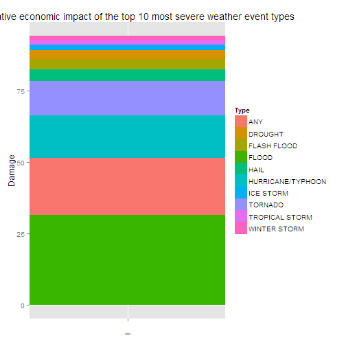

### Synopsis
The report gives brief summary on impact of sever weather events on public and economic of the U. S. between 1950 and 2011. From the public health perspective of view, heat-related sever weather events  become a significant problem. On the other hand, floods cost a lot and kill quite a lot of people.

### Data processing

The data was obtained from the U.S. National Oceanic and Atmospheric Administration's (NOAA) [storm database](https://d396qusza40orc.cloudfront.net/repdata%2Fdata%2FStormData.csv.bz2)

```r
stormZip <- "storm.bz2"
if (file.access(stormZip, 4))
{
  stormUrl <-
    "http://d396qusza40orc.cloudfront.net/repdata%2Fdata%2FStormData.csv.bz2"
  download.file(stormUrl, stormZip)
}
storm <- read.csv(stormZip, stringsAsFactors = F)
```
The total number of observations in the set is

```r
nrow(storm)
```

```
## [1] 902297
```
According to [NWS Directive 10-1605](http://www.ncdc.noaa.gov/stormevents/pd01016005curr.pdf) any event must fall into one of following categories

```r
eventTypes <-
  c("ASTRONOMICAL LOW TIDE", "AVALANCHE",               
    "BLIZZARD",
    "COASTAL FLOOD", "COLD/WIND CHILL", "DEBRIS FLOW",
    "DENSE FOG", "DENSE SMOKE", "DROUGHT", "DUST DEVIL", "DUST STORM",
    "EXCESSIVE HEAT", "EXTREME COLD/WIND CHILL",
    "FLASH FLOOD", "FLOOD", "FROST/FREEZE", "FUNNEL CLOUD", "FREEZING FOG", 
    "HAIL", "HEAT", "HEAVY RAIN", "HEAVY SNOW", "HIGH SURF", "HIGH WIND", "HURRICANE/TYPHOON",
    "ICE STORM",
    "LAKE-EFFECT SNOW", "LAKESHORE FLOOD", "LIGHTNING",
    "MARINE HAIL", "MARINE HIGH WIND", "MARINE STRONG WIND", "MARINE THUNDERSTORM WIND",
    "RIP CURRENT",
    "SEICHE", "SLEET", "STORM SURGE/TIDE", "STRONG WIND",
    "THUNDERSTORM WIND", "TORNADO", "TROPICAL DEPRESSION", "TROPICAL STORM", "TSUNAMI",
    "VOLCANIC ASH",
    "WATERSPOUT", "WILDFIRE", "WINTER STORM", "WINTER WEATHER")
```
The propotion of properly marked observations in the set is

```r
storm$EVTYPE <- toupper(storm$EVTYPE)
properlyMarked <- storm$EVTYPE %in% eventTypes
sum(properlyMarked) / length(storm$EVTYPE) * 100
```

```
## [1] 70.42459
```
Following events either aren't represented in the set or improperly marked

```r
eventTypes[!(eventTypes %in% storm$EVTYPE)]
```

```
## [1] "DEBRIS FLOW"
```
The propotion of partially marked observations in the set is

```r
partiallyMarked <- storm$EVTYPE %in%
                   grep(paste(eventTypes, collapse = "|"),
                        unique(storm$EVTYPE[!properlyMarked]), value = T)
sum(partiallyMarked) / length(storm$EVTYPE) * 100
```

```
## [1] 3.195954
```
For the purpose of the analysis improperly marked observaions are grouped under "ANY" section. The impact on public health is judged based on numbers of killed `FATALITIES` and injuried `INJURIES` people. The economic impact - on property damage `PROPDMG` and crop damage `CROPDMG` in billions of U. S. $.

```r
library(dplyr)

storm <- storm %>% select(EVTYPE, FATALITIES, INJURIES, PROPDMG, PROPDMGEXP, CROPDMG, CROPDMGEXP)
for (i in 1:length(eventTypes))
{
  storm$EVTYPE[grep(paste0("^", eventTypes[i], "$"), storm$EVTYPE)] <- eventTypes[i]
}
storm$EVTYPE[!(storm$EVTYPE %in% eventTypes)] <- "ANY"

storm$PROPDMG[storm$PROPDMGEXP == "K"] <- storm$PROPDMG[storm$PROPDMGEXP == "K"] * (10^3)
storm$PROPDMG[storm$PROPDMGEXP == "M"] <- storm$PROPDMG[storm$PROPDMGEXP == "M"] * (10^6)
storm$PROPDMG[storm$PROPDMGEXP == "B"] <- storm$PROPDMG[storm$PROPDMGEXP == "B"] * (10^9)
storm$PROPDMG <- storm$PROPDMG / (10^9)

storm$CROPDMG[storm$CROPDMGEXP == "K"] <- storm$CROPDMG[storm$CROPDMGEXP == "K"] * (10^3)
storm$CROPDMG[storm$CROPDMGEXP == "M"] <- storm$CROPDMG[storm$CROPDMGEXP == "M"] * (10^6)
storm$CROPDMG[storm$CROPDMGEXP == "B"] <- storm$CROPDMG[storm$CROPDMGEXP == "B"] * (10^9)
storm$CROPDMG <- storm$CROPDMG / (10^9)

storm <- storm %>% select(EVTYPE, FATALITIES, INJURIES, PROPDMG, CROPDMG)

sum(storm$EVTYPE == "ANY") / length(storm$EVTYPE) * 100
```

```
## [1] 29.57541
```

```r
sum(storm$EVTYPE %in% eventTypes) / length(storm$EVTYPE) * 100
```

```
## [1] 70.42459
```
### Results
Event types ordered by total number of people killed

```r
healthImpact <- storm %>%
                group_by(EVTYPE) %>%
                rename(Type = EVTYPE) %>%
                summarise(Killed = sum(FATALITIES),
                          Injuried = sum(INJURIES)) %>%
                arrange(desc(Killed), desc(Injuried))
healthImpact
```

```
## Source: local data frame [48 x 3]
## 
##              Type Killed Injuried
## 1         TORNADO   5633    91346
## 2             ANY   2023    12558
## 3  EXCESSIVE HEAT   1903     6525
## 4     FLASH FLOOD    978     1777
## 5            HEAT    937     2100
## 6       LIGHTNING    816     5230
## 7           FLOOD    470     6789
## 8     RIP CURRENT    368      232
## 9       HIGH WIND    248     1137
## 10      AVALANCHE    224      170
## ..            ...    ...      ...
```
Even though tornado's impact on public health have been recorded for more than 60 years, just 15 years of collecting data on the heat-related events shows that this is quite serious problem. It probably was overlooked in the past due to inability to effectively collect data.

Event types ordered by the total property damage in bilions of U. S. dollars

```r
economicImpact <- storm %>%
                group_by(EVTYPE) %>%
                rename(Type = EVTYPE) %>%
                summarise(Property = sum(PROPDMG),
                          Crop = sum(CROPDMG)) %>%
                arrange(desc(Property), desc(Crop))
economicImpact
```

```
## Source: local data frame [48 x 3]
## 
##                 Type   Property       Crop
## 1              FLOOD 144.657710  5.6619684
## 2                ANY  82.959535 11.8483725
## 3  HURRICANE/TYPHOON  69.305840  2.6078728
## 4            TORNADO  56.925661  0.4149533
## 5        FLASH FLOOD  16.140812  1.4213171
## 6               HAIL  15.727367  3.0255379
## 7     TROPICAL STORM   7.703891  0.6783460
## 8       WINTER STORM   6.688497  0.0269440
## 9          HIGH WIND   5.270046  0.6385713
## 10          WILDFIRE   4.765114  0.2954728
## ..               ...        ...        ...
```
Just 15 years of observations shows that floods entail the largest economic consequences. They also kill significant number of people.

The figure below summarize total economic impact of the top 10 most sever weather event types

```r
library(ggplot2)

totalDamage <- sum(storm$PROPDMG) + sum(storm$CROPDMG)
relativeEconomicImpact <- storm %>%
                          group_by(EVTYPE) %>%
                          rename(Type = EVTYPE) %>%
                          summarise(Damage = sum(PROPDMG) + sum(CROPDMG)) %>%
                          top_n(10, Damage) %>%
                          arrange(desc(Damage))
relativeEconomicImpact$Damage <- relativeEconomicImpact$Damage / totalDamage * 100
g <- ggplot(relativeEconomicImpact, aes(x = "", y = Damage, fill = Type)) +
     geom_bar(width = 1, stat = "identity") +
     ggtitle("Total relative economic impact of the top 10 most severe weather event types")
print(g)
```

 

### Further work
One may notice that improperly marked events ("ANY") killed quite a few people and caused significant amount of damage, so more effort should be made to properly classify observations in NOAA's set. This work is planned for the future versions of the report.
